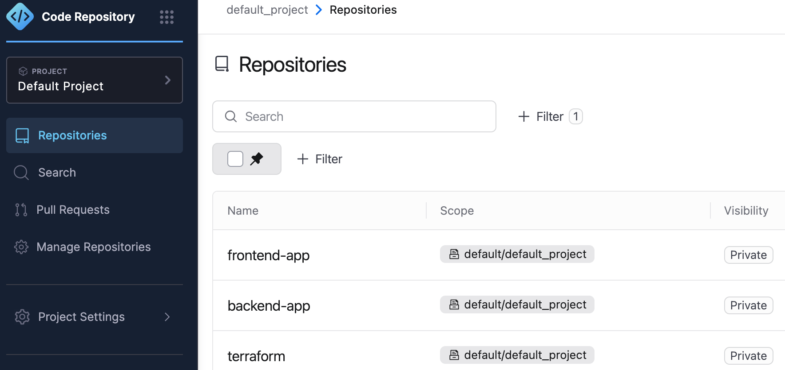
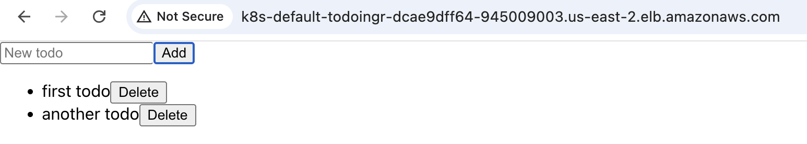
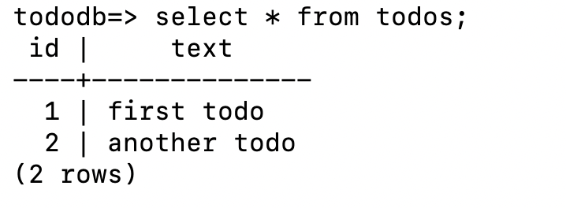
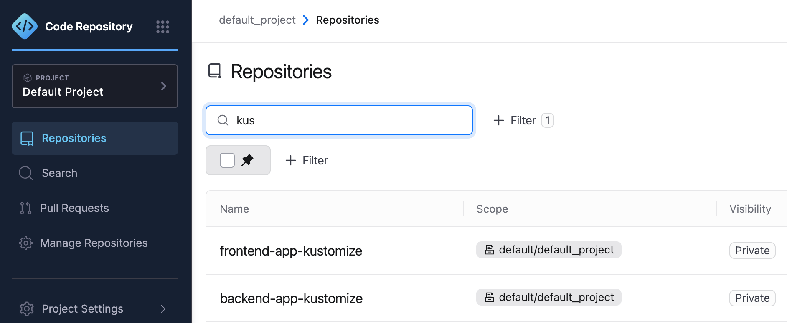
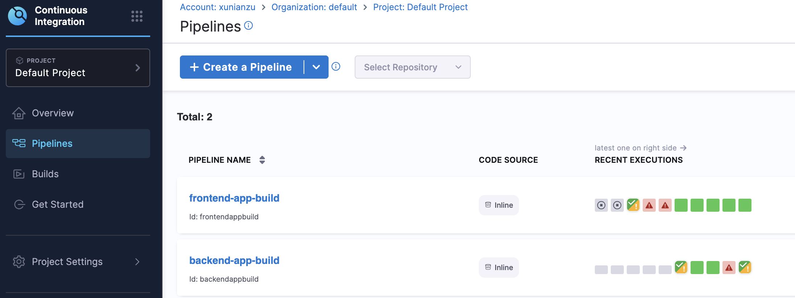
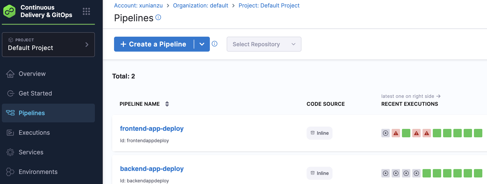

# Task 0: codebase

All code is stored on Harness Code Repository.

Please login Harness using my email xunianzu@gmail.com and the provided password.




The hello-world project consists of two applications:

The frontend app is a React SPA where you can list, add and delete todos.



The backend app is a Spring Boot application which provides the corresponding APIs and saves the todos into PostgreSQL, namely AWS RDS.



# Task 1: Infrastructure as Code

Terraform code for creating AWS EKS and RDS can be found on Harness Code Repository.


# Task 2: Kubernetes

Kubernetes maninfests of Deployment, Service and Ingress for each environments are stored in these two repositories.



# Task 3: Pipeline as Code

## Task 3.1: Infra Pipeline

Infra pipeline hasn't been implemented yet.

To create EKS and RDS, clone the Terraform code from Harness Code Repoistory and run the terraform commands.

For example, to set up EKS for dev environment:

```bash
cd clusters/dev/eks
terraform plan
terraform apply
```

The Terraform code is mainly from these two repositories:

https://github.com/hashicorp-education/learn-terraform-provision-eks-cluster
https://github.com/hashicorp-education/learn-terraform-rds


## Task 3.1: Service Pipeline

These two CI pipelines are for building the apps and Docker images.



When new git commit or branch is pushed to code repository, the CI pipeline will be trigger automatically.

The app will be built using NPM or Gradle, and the Docker image will be published to Docker registry.

https://hub.docker.com/repository/docker/joekyo/todo-frontend-app/
https://hub.docker.com/repository/docker/joekyo/todo-backend-app/

These two CD pipelines are for deploying the apps to Kubernetes clusters using the above manifests code with Kustomize.


